# Production-Grade MLOps Pipeline for Customer Churn Prediction

This project demonstrates a complete, end-to-end MLOps pipeline for a classic customer churn prediction problem. The pipeline automates the entire machine learning lifecycle, from data ingestion and validation to model training, deployment on AWS SageMaker, and monitoring. By leveraging MLOps best practices, this system ensures that new models can be efficiently trained, validated, and deployed to a production environment with minimal manual intervention.

[](https://github.com/Mihaivich/mlops-churn-project/actions/workflows/ci-cd.yml)

## Live Demo

[](https://mlops-churn-project.streamlit.app/)

## Project Overview

The primary goal of this project is not just to build an accurate churn prediction model, but to build a robust, reproducible, and automated system around it. This system ensures that new models can be trained, validated, and deployed to a production-like environment with minimal manual intervention, following MLOps best practices.

### Architecture Diagram

The diagram below illustrates the complete workflow, from code commit to a live, monitored prediction endpoint.

```mermaid
graph TD
    %% --- Define Styles for different components ---
    classDef dev fill:#4A90E2,stroke:#2E5C8A,stroke-width:2px,color:#FFFFFF;
    classDef cicd fill:#52C41A,stroke:#237804,stroke-width:2px,color:#FFFFFF;
    classDef aws fill:#FF9500,stroke:#D84A00,stroke-width:2px,color:#FFFFFF;
    classDef data fill:#722ED1,stroke:#391085,stroke-width:2px,color:#FFFFFF;

    %% --- Define Nodes (the components) ---
    User[👨‍💻 Developer]:::dev
    GitHub(🐙 GitHub Repo):::cicd
    GHA(🤖 GitHub Actions):::cicd
    S3(🗃️ S3 Bucket for DVC):::data
    CodeBuild(🛠️ AWS CodeBuild):::aws
    ECR(🐳 AWS ECR):::aws
    SageMaker[🧠 SageMaker Endpoint]:::aws
    CloudWatch(📊 AWS CloudWatch):::aws
    WebApp[🌐 Streamlit App / End User]:::dev

    %% --- Define the Flow (the connections) ---
    subgraph "Development & Trigger"
        User -- "git push" --> GitHub
        GitHub -- Triggers Workflow --> GHA
    end

    subgraph "CI: Retrain Model (GitHub)"
        GHA -- "Runs 'dvc repro'" --> S3
        S3 -- "Pulls data / Pushes new model" --> GHA
    end

    subgraph "CD: Build & Deploy (AWS)"
        GHA -- Triggers --> CodeBuild
        CodeBuild -- Pulls Source Code --> GitHub
        CodeBuild -- Pulls New Model --> S3
        CodeBuild -- "Builds & Pushes Image" --> ECR
        CodeBuild -- "Runs deploy.py" --> SageMaker
        ECR -- "Provides Image" --> SageMaker
    end

    subgraph "Production & Monitoring"
        WebApp -- "HTTPS Request (Invoke)" --> SageMaker
        SageMaker -- "Returns Prediction" --> WebApp
        SageMaker -- "Sends Metrics & Logs" --> CloudWatch
        CloudWatch -- "Sends Alerts" --> User
    end
```



### The Dataset

The data for this project is the **Telco Customer Churn** dataset, publicly available on Kaggle.

- **Data Source**: [Kaggle Telco Customer Churn](https://www.kaggle.com/datasets/blastchar/telco-customer-churn)
- **Data Schema**: The dataset includes customer-level information. Key features include:
  - `gender`: The customer's gender (Male / Female).
  - `tenure`: Number of months the customer has stayed with the company.
  - `Contract`: The customer's contract term (Month-to-month, One year, Two year).
  - `MonthlyCharges`: The amount charged to the customer monthly.
  - `Churn`: The target variable, indicating whether the customer churned (Yes / No).
- **Privacy Considerations**: The dataset is fully anonymized and does not contain any Personally Identifiable Information (PII). The privacy risk associated with its use is low.

### Model Performance

The final baseline model achieved the following performance on the test set:

| Metric      | Score     |
| :---------- | :-------- |
| **ROC AUC** | **0.832** |
| Accuracy    | 0.791     |
| Precision   | 0.629     |
| Recall      | 0.521     |
| F1 Score    | 0.570     |

_(Results are from `reports/metrics.json`)_

### MLOps Pipeline Stages

The core pipeline is managed by DVC and defined in `dvc.yaml`. It consists of the following stages:

1.  **`data_ingest`**: Loads the raw dataset and performs initial cleaning.
2.  **`data_validation`**: Validates the staged data against a defined schema, checking for missing values and distribution anomalies.
3.  **`train_and_tune`**: Splits the data, preprocesses features, trains a model (Scikit-learn Pipeline), and performs hyperparameter tuning.
4.  **`evaluate`**: Evaluates the best model on a test set and generates performance metrics (`reports/metrics.json`).

## Tech Stack

- **Cloud**: AWS (SageMaker, S3, ECR, CodeBuild, CloudWatch)
- **ML/Data**: Python, Scikit-learn, Pandas
- **MLOps Tools**: DVC, MLflow (Optional)
- **CI/CD**: GitHub Actions
- **Containerization**: Docker
- **Web App**: Streamlit

## Project Structure

```
.
├── .dvc/
├── .github/workflows/ci-cd.yml
├── data/
│   ├── raw/
│   └── staged/
├── images/
│   └── architecture.png
├── inference/
│   └── predict.py
├── model/
│   └── model.joblib
├── reports/
│   └── metrics.json
├── src/
│   ├── data_ingest.py
│   ├── data_validation.py
│   ├── train_and_tune.py
│   └── evaluate.py
├── app.py
├── buildspec.yml
├── deploy.py
├── Dockerfile
├── dvc.lock
├── dvc.yaml
├── params.yaml
├── README.md
└── requirements.txt
```

## Setup & Local Installation

Follow these steps to set up the project environment on your local machine.

### Prerequisites

- Python 3.11+
- Git
- DVC
- AWS CLI configured with your credentials (`aws configure`)

### Installation Steps

1.  **Clone the repository:**

    ```bash
    git clone https://github.com/Mihaivich/mlops-churn-project.git
    cd mlops-churn-project
    ```

2.  **Create and activate a virtual environment:**

    ```bash
    python3 -m venv venv
    source venv/bin/activate
    ```

3.  **Install dependencies:**

    ```bash
    pip install -r requirements.txt
    ```

4.  **Configure DVC remote storage:**
    ```bash
    # (Optional, if you want to push to your own DVC remote)
    dvc remote add myremote s3://<your-s3-bucket-name>
    ```

## How to Run

### Local Pipeline Execution

1.  **Pull data and models from DVC remote:**

    ```bash
    dvc pull
    ```

2.  **Run the entire DVC pipeline:**
    ```bash
    dvc repro
    ```
    This command will execute all stages defined in `dvc.yaml` if their dependencies have changed.

### Running the Web Application

To interact with the deployed model, run the Streamlit web application.

1.  **Ensure your SageMaker endpoint is `InService`.**

2.  **Run the app:**
    ```bash
    streamlit run app.py
    ```
    Your web browser will automatically open the application.

## CI/CD Automation

This project is configured with a full CI/CD pipeline using GitHub Actions. The workflow is defined in `.github/workflows/ci-cd.yml`.

- **Trigger**: The pipeline automatically runs on every `push` to the `master` branch.
- **Process**:
  1.  The GitHub Action runner sets up the environment and installs dependencies.
  2.  It runs `dvc repro` to retrain the model with the latest code and data.
  3.  It pushes the new model artifact to the DVC remote (S3).
  4.  It triggers an AWS CodeBuild project.
  5.  CodeBuild builds a new Docker image, pushes it to ECR, and runs the `deploy.py` script to update the SageMaker endpoint.

## Deployment Steps (Manual)

While the project is automated, here are the steps to perform a manual deployment using AWS CloudShell.

1.  **Start AWS CloudShell** from the AWS Management Console.
2.  **Clone the repository and pull artifacts:**
    ```bash
    git clone https://github.com/Mihaivich/mlops-churn-project.git
    cd mlops-churn-project
    dvc pull
    ```
3.  **Build and push the Docker image to ECR:**
    ```bash
    # (Ensure you are logged into ECR first)
    docker build -t churn-predictor .
    docker tag churn-predictor:latest <Your ECR Image URI>
    docker push <Your ECR Image URI>
    ```
4.  **Run the deployment script:**
    ```bash
    python3 deploy.py
    ```
5.  **Test the endpoint:**
    Once the endpoint status is `InService`, run the test script:
    ```bash
    python3 test_endpoint.py
    ```

## Governance and Optional Features

This project implements several MLOps concepts:

- **Web Application Integration**: A live, interactive web app has been built with Streamlit and deployed to Streamlit Community Cloud for real-time predictions.
- **Approval Workflow**: A model approval process is defined based on GitHub Pull Requests, where code and model performance metrics must be reviewed before merging to `master` and triggering a deployment.
- **Incident Response**: A playbook has been designed to respond to CloudWatch alarms for high model latency or invocation errors, with a clear rollback strategy.

